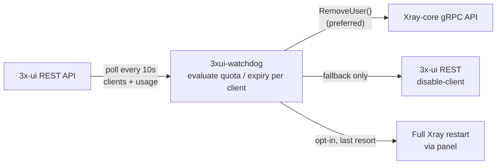

# 3xui-watchdog

<!--
  docs/screenshots/demo.gif goes here, above the fold. Not included in this
  scaffold — record a real 15-20s terminal capture (asciinema -> gif, or
  vhs/termtosvg) showing: client hits quota -> watchdog logs detection
  within a few seconds -> RemoveUser call -> session actually dies in a
  live traffic graph or tcpdump. That single artifact does more for star
  conversion than anything else in this README; see the roadmap below.
-->
<!--  -->

[](../../actions)
[](LICENSE)
[](../../releases)
[](pyproject.toml)
[](https://ghcr.io/power0matin/3xui-watchdog)

**Real-time watchdog for 3X-UI/Xray-core that instantly disconnects clients
the moment their traffic quota or expiry is hit — no waiting, no full Xray
restart.**

## The problem

[3X-UI](https://github.com/MHSanaei/3x-ui) lets you set a traffic quota
and/or expiry date per client, but there's a well-documented gap: when a
client hits that limit, the panel updates its database and rewrites Xray's
config, but existing, already-established Xray sessions for that client can
keep transferring data for a minute or two (sometimes longer under load)
before Xray actually tears the connection down. This happens because Xray's
per-direction proxying doesn't always close both halves of a tunnel
immediately when a user is removed from the config. On a busy server this
lets users burn meaningfully more traffic than they were allotted, and in
the worst case — a stuck restart loop — the panel can end up repeatedly
restarting Xray core, disconnecting *everyone*, not just the offending
client.

3xui-watchdog is an external, opt-in daemon that polls panel/Xray state
independently and acts on just the offending client — no patch to 3x-ui or
Xray required.

## How it works



*(GitHub renders the block above as a diagram automatically. If you're
viewing this somewhere that doesn't support Mermaid, see the plain-English
list of the same flow just below.)*

Every poll cycle, the watchdog independently evaluates each client against
the same rule 3x-ui itself uses (`total > 0 && used >= total`, or
`expiryTime != 0 && now > expiryTime`) — it does not wait for the panel to
have already noticed. When a client is over the line, it acts in this order:

1. **Preferred:** call Xray's gRPC `HandlerService.RemoveUser(inboundTag,
   email)` directly — removes just that one client from the running config
   in-memory, no file rewrite, no core restart, and it drops that client's
   already-alive connection state immediately.
2. **Fallback A:** if the gRPC API isn't reachable, disable that one client
   via the 3x-ui REST API instead.
3. **Fallback B (opt-in, off by default):** trigger a full Xray restart via
   the panel, only after a configurable grace period. This is the "nuclear
   option" — it disconnects *every* user on the server — and is clearly
   labeled as such in logs and notifications.

A config-rewrite-and-restart is never the default path; that's the exact
failure mode this tool exists to avoid.

## Quick start

### One-line install (recommended for a VPS)

Mirrors 3x-ui's own installer UX — handles OS package detection, an isolated
virtualenv (no `--break-system-packages` needed), a dedicated system user,
and the systemd service, all in one step:

```bash
bash <(curl -Ls https://raw.githubusercontent.com/power0matin/3xui-watchdog/main/install.sh)
```

Then edit `/etc/3xui-watchdog/config.yaml` with your panel URL/credentials
and Xray gRPC host:port, and start it:

```bash
sudo systemctl start 3xui-watchdog
sudo journalctl -u 3xui-watchdog -f
```

Safe to re-run any time (updates the code/venv in place, never touches an
existing `config.yaml`). To uninstall:

```bash
bash <(curl -Ls https://raw.githubusercontent.com/power0matin/3xui-watchdog/main/install.sh) --uninstall
```

See `install.sh --help` for flags (custom install path, skipping the
systemd unit for Docker/cron setups, pinning a specific release, etc).

### Docker

```bash
cp config.example.yaml config.yaml
# edit config.yaml: panel URL/credentials, Xray gRPC host:port

docker run -d --name 3xui-watchdog \
  --network host \
  -v $(pwd)/config.yaml:/app/config.yaml:ro \
  ghcr.io/power0matin/3xui-watchdog:latest
```

Or with Compose — see [`docker-compose.example.yml`](docker-compose.example.yml).

### Manual systemd (if you'd rather not use install.sh)

```bash
pip install "3xui-watchdog[grpc]" --break-system-packages
sudo mkdir -p /etc/3xui-watchdog
sudo cp config.example.yaml /etc/3xui-watchdog/config.yaml   # then edit it
sudo cp systemd/3xui-watchdog.service /etc/systemd/system/
sudo systemctl daemon-reload
sudo systemctl enable --now 3xui-watchdog
```

### Bare Python / cron

```bash
pip install "3xui-watchdog[grpc]" --break-system-packages
xui-watchdog --config config.yaml            # run forever
xui-watchdog --config config.yaml --once      # single pass — put this in cron
xui-watchdog --config config.yaml --dry-run   # log only, take no action
```

## Config reference

All keys can also be set via `XUIWD_<SECTION>__<KEY>` environment variables
(double underscore for nesting), which override the file. See
[`config.example.yaml`](config.example.yaml) for the full annotated example.

| Key | Default | Description |
|---|---|---|
| `poll_interval_seconds` | `10` | How often to poll, matching 3x-ui's own internal check interval |
| `once` | `false` | Single pass then exit (cron mode); same as `--once` |
| `dry_run` | `false` | Log intended actions, take none; same as `--dry-run` |
| `log_level` | `INFO` | Standard Python logging levels |
| `log_json` | `false` | Structured JSON logs, good for log shippers |
| `panel.base_url` | — | 3x-ui panel URL |
| `panel.auth_mode` | `password` | `password` (session cookie) or `token` (static API token) |
| `panel.username` / `panel.password` | — | Used when `auth_mode: password` |
| `panel.api_token` | — | Used when `auth_mode: token` |
| `panel.verify_tls` | `true` | Set `false` only for self-signed certs on a trusted LAN |
| `xray_grpc.enabled` | `true` | Use the direct gRPC path when available |
| `xray_grpc.host` / `xray_grpc.port` | `127.0.0.1:10085` | Xray's API inbound |
| `restart_fallback.enabled` | `false` | Enable the "nuclear" full-restart fallback |
| `restart_fallback.grace_period_seconds` | `120` | Wait this long before restarting, once gRPC+REST both fail |
| `notify.webhook_url` | — | POSTs a JSON payload per action taken |
| `notify.telegram_bot_token` / `notify.telegram_chat_id` | — | Telegram notifications per action taken |

## Compatibility

| | Tested |
|---|---|
| 3x-ui version | v2.5.x line (REST endpoints versioned in `panel_client.py` so a future v4 API is a contained change) |
| DB backend | N/A — the watchdog only ever talks to 3x-ui over HTTP, never touches SQLite/Postgres directly |
| Auth modes | Session-cookie login (`password`); static API token (`token`) where the panel version exposes one |

If you're running an older or newer panel version and something doesn't
match, please open an issue with your exact 3x-ui version — the endpoint
paths are intentionally isolated in one file to make version-specific
patches easy to land.

## FAQ

**Why not just decrease 3x-ui's own polling interval instead?**
You can, and it helps, but it doesn't eliminate the underlying issue: Xray's
own connection teardown for an already-established session isn't always
immediate even once the panel has removed the client from its config and
rewritten Xray's config file. This tool closes that specific gap by calling
Xray's `RemoveUser` directly, which acts on the live session state rather
than waiting on a config reload.

**Does this replace 3x-ui's own traffic checker?**
No. It runs alongside it as a faster, independent enforcement layer. 3x-ui's
own checker keeps doing its normal job (including updating its database and
UI); this tool just also watches directly and can act sooner via the
lower-latency gRPC path.

**Will re-enabling a client work automatically after I bump their quota or
extend their expiry?**
Yes — the watchdog uses `RemoveUser`/disable rather than deleting the client
from 3x-ui's own database, so the client still exists in the panel. On the
next reconcile pass, if the client is valid again, the watchdog re-admits
them automatically (see `policy.should_readmit` / `enforcer.Enforcer._readmit`)
— no manual restart needed.

**Does it work if the Xray gRPC API port isn't exposed?**
Yes, it falls back to disabling the client through the 3x-ui REST API
instead (slightly higher latency, but no extra port to expose).

## Testing

- **Unit tests** (`tests/`) cover the depletion/expiry detection logic in
  `policy.py` as pure functions — no network, no mocks, run with
  `pytest tests/ --ignore=tests/integration` or plain
  `python -m unittest discover -s tests`.
- **Integration tests** (`tests/integration/`) spin up a real 3x-ui + Xray
  instance via `tests/integration/docker-compose.ci.yml` and exercise the
  REST client end to end. Run locally with
  `docker compose -f tests/integration/docker-compose.ci.yml up -d --wait`
  then `pytest tests/integration -m integration`.

## Known scaffolding gaps

Being upfront about what's genuinely finished vs. what's a scaffold in this
initial version:

- **Xray gRPC protobuf stubs are not vendored.** Xray-core doesn't publish a
  pip-installable Python gRPC client; generating real stubs requires
  `grpc_tools.protoc` against Xray-core's own `.proto` sources. The one-time
  command to generate them is documented at the top of
  `src/xui_watchdog/xray_grpc_client.py`. Until that's run and the
  generated `_xray_pb2` package is committed (or generated in CI), the
  watchdog automatically and safely falls back to the REST API path — it
  will not silently no-op.
- **Go implementation** (using 3x-ui's own `xray` package directly, which
  already exposes `RemoveUser`/`GetTraffic`/`AddUser`) is on the roadmap
  below but not started in this initial scaffold.
- **Demo GIF** is not included yet — see the comment at the top of this
  README.

## Roadmap / good first issues

- [ ] Generate and commit Xray-core protobuf stubs (or wire up CI to
      generate them from a pinned Xray-core tag) — unblocks the preferred
      gRPC enforcement path end-to-end
- [ ] Go implementation using `github.com/mhsanaei/3x-ui/v2/xray`
- [ ] Record and add the demo GIF
- [x] `curl | bash` one-line installer mirroring 3x-ui's own installer UX — see `install.sh`
- [ ] Webhook payload schema versioning + a couple of ready-made
      integrations (Discord, Slack formatting presets)
- [ ] Metrics endpoint (Prometheus) alongside the webhook/Telegram
      notifications

## Contributing

Issues and PRs welcome — see the roadmap above for good starting points.
Please run `ruff check`, `mypy src`, and the unit tests before opening a PR;
CI runs all three plus the integration stack.

## Scope

This tool only ever acts on 3x-ui/Xray instances **you administer and hold
credentials for** — it enforces *your own* quota/expiry policy faster than
the panel's default reconcile loop. It is not designed to interact with,
probe, or affect any panel or server you do not control. See
[SECURITY.md](SECURITY.md) for the disclosure policy.

## License

[MIT](LICENSE)
